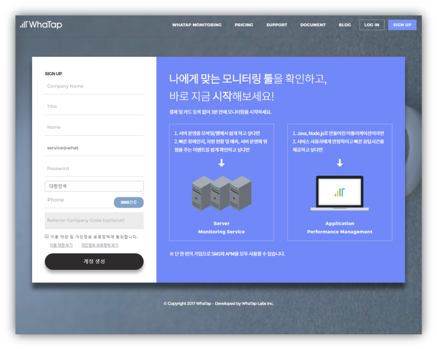
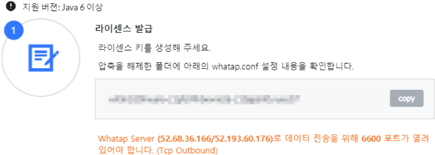
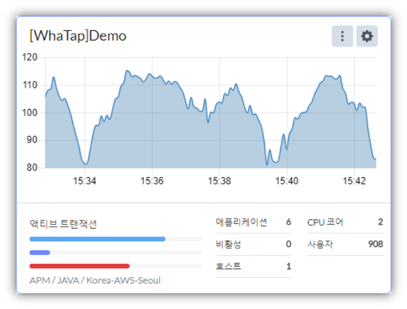
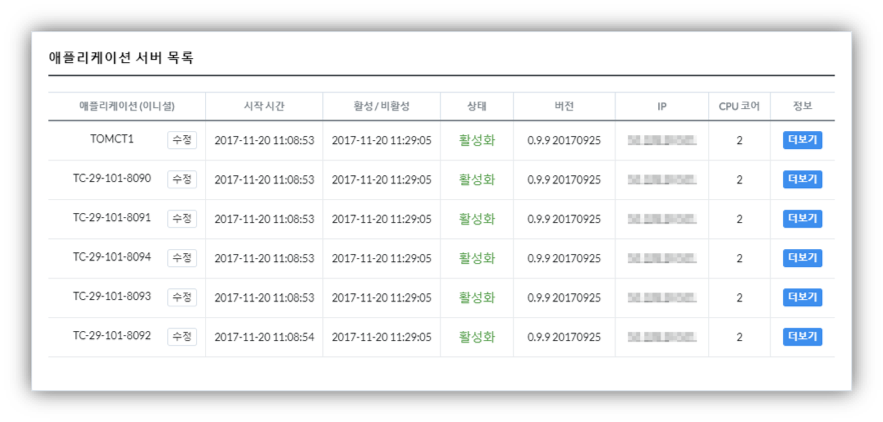
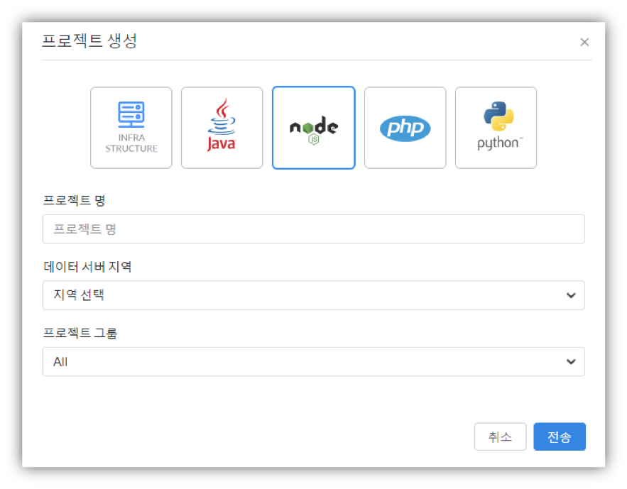

# 퀵스타트 가이드

### 공통 {#user-content-공통}

#### 회원 가입 {#user-content-회원-가입}

* 회사 계정, 회사 타이틀\(직급\), 이름, SMS 인증, 회사명, 비밀번호, 회사 참조 코드\(옵션\)을 입력하여 회원가입을 진행합니다.
* 회원가입 완료 후 등록한 이메일로 가입 승인 안내 메일이 전송됩니다.
* 이메일을 확인하여 가입승인을 완료하면 와탭 계정이 생성 됩니다



### Java 애플리케이션 모니터링 {#user-content-java-애플리케이션-모니터링}

#### javaagent + onetime attach {#user-content-javaagent-onetime-attach}

본 가이드는 와탭 APM 모니터링의 3가지 설치 방식 중 “javaagent + onetime attach” 방식을 대상으로 합니다. “javaagent + onetime attach” 방식은 실행 중인 애플리케이션 서버에 와탭 APM 모니터링을 적용하고, 애플리케이션 서버 재기동 시 “javaagent” 방식으로 실행하고자 하는 경우에 적용하는 방식입니다. \(attach 방식으로 설치할 경우 일부 쿼리 데이터가 정상적으로 수집되지 않을 수 있습니다.\) ==== 설치 환경 설치 환경 구성

* OS: Linux
* 애플리케이션 서버: Tomcat
  * Tomcat이 아닌 다른 WAS의 JVM 옵션 추가 방법은 APM 콘솔 내 Management - 에이전트 설치 메뉴에서 확인할 수 있습니다
* 에이전트 설치 방식: “javaagent + onetime attach”

Windows에 진행하고 있다면 5장의 Java 애플리케이션 모니터링을 참조하세요.

**에이전트 구성 파일**

모니터링 정보를 수집하여 서버에 전송하기 위한 Tracer, Tracer를 실행 중인 애플리케이션 서버에 동적으로 적용하기 위한 attach 스크립트, 에이전트를 디버깅하기 위한 쉘 스크립트 파일로 구성됩니다.

와탭 모니터링 에이전트를 구성하는 각 파일의 역할은 다음과 같습니다.

| 파일명 | 설명 |
| :--- | :--- |
| whatap.agent.tracer-\#.\#.\#.jar | \(Tracer 프로그램\) 웹 애플리케이션 서버 프로세스에 Attach되어 정보를 수집하고 수집된 정보를 서버로 전송하는 프로그램 |
| whatap.conf | 애플리케이션 서버의 데이터를 수집하는 수집서버의 주소와 서버의 프로젝트 라이선스 키가 입력되는 파일 |
| javaproc.sh\(bat\) | 실행중인 자바 프로세스들의 PID와 JVM 옵션을 확인을 위한 쉘스크립트 |
| resmon.sh\(bat\) | CPU/Memory/Disk 정보 추출을 위한 쉘스크립트 |
| attach.sh\(bat\) | 실행 중인 애플리케이션 서버에 일회성으로 Tracer를 적용하기 위한 쉘스크립트 |

**에이전트 설치 절차**

와탭 APM 모니터링 서비스를 사용하기 위해서는 모니터링 대상 애플리케이션에 와탭 APM 모니터링 에이전트를 설치해야 합니다.

와탭 APM 모니터링 에이전트 설치 방법은 [www.whatap.io](http://www.whatap.io/) 사이트에서 압축된 에이전트 파일을 다운로드 받아 서버 임의의 위치에 압축을 풀어 실행하는 것만으로 설치가 완료됩니다.

**프로젝트 생성**


서버를 등록하기 위해 우선 프로젝트를 생성합니다. 추가 버튼을 선택하면 아래와 같이 프로젝트 생성 창이 나타납니다. Java 아이콘을 선택한 뒤, 희망하는 프로젝트명과 데이터 서버 지역\(Region\), 소속하게 될 그룹을 선택한 뒤 프로젝트를 생성합니다.


이후, 생성된 프로젝트를 클릭하여 관리 화면에 진입합니다

**라이선스 발급**



프로젝트 관리화면에서는 우선적으로 라이선스를 발급 받습니다. 라이선스 키는 프로젝트별로 귀속되기 때문에, 유출되거나 배포되어서는 안됩니다. 반드시 본인 프로젝트에 서버를 등록할 때에만 이용하시기 바랍니다.

**에이전트 다운로드**


라이선스를 발급 받은 후에는 ‘에이전트 파일 다운로드’ 버튼이 활성화 되었음을 확인할 수 있습니다. 해당 버튼을 눌러 와탭 에이전트 파일을 다운로드 받습니다.

다운로드가 완료되면 안에 있는 whatap.conf 파일의 설정을 확인하여 라이선스키와 데이터 수집 서버 주소가 정상적으로 들어가 있는지를 확인합니다.

```text
license={라이선스 키}
whatap.server.host={수집서버 정보}
```

* wget으로 직접 다운 받을 경우, whatap.conf 파일에 라이선스키와 데이터 수집 서버 주소가 정상적으로 들어가지 않습니다. 해당 방식으로 다운 받을 경우, 업로드 후 별도로 라이선스키와 데이터 수집 서버 주소를 넣어주시기 바랍니다.

**에이전트 업로드**

애플리케이션 서버가 설치된 서버에 접속하고, 다운로드 받은 에이전트 파일을 업로드 한 후, 압축해제를 합니다.

* $WHATAP\_HOME은 와탭 APM 모니터링 에이전트의 설치 경로를 가리키며, 이후 본 문서에서 이와 같이 기술합니다.
* 에이전트는 수집 서버 주소로 애플리케이션 서버의 성능 정보를 전송합니다. 그러므로 방화벽에 수집 서버 IP로의 TCP 아웃바운드 포트 \(6600\)이 차단되어 있으면 안됩니다.

**에이전트 설치**

실행 중인 애플리케이션 서버의 PID를 확인하기 위해 javaproc 스크립트를 실행합니다.

```bash
$ ./javaproc.sh
JAVA_HOME=/jdk1.7.0_79

  WhaTap Java Process Utility v1.0
  Copyright © 2016 WhaTap Labs Inc. All rights reserved.
    Pid    Application
  ------  -------------
    2583  org.apache.catalina.startup.Bootstrap start
  ------  -------------
 User: ec2-user
 Java Path: /jdk1.7.0_79/jre
 Java Version: 1.7.0_79
```

에이전트 적용’에서 진행하게 될 Attach 방식은 실행 중인 애플리케이션에만 적용이 되며, 애플리케이션 재실행시에는 적용되지 않기 때문에 재기동시 자동 설정을 위해서는 아래 코드를 적용해주어야 합니다. 애플리케이션 서버 JVM 옵션에 아래와 같은 -javaagent 설정을 추가합니다.

```text
-javaagent:{에이전트 설치 경로}/whatap.agent.tracer-#.#.#.jar
```

* 위 옵션은 javaagent 프로퍼티 값의 절대 경로 입니다.

항상 $WHATAP\_HOME 하위에 설치된 최상위 버전의 에이전트로 기동하고자 하는 경우, 하기의 스크립트를 참조하여 적용합니다.

```text
########## WHATAP ############
WHATAP_HOME=/whatap
WHATAP_JAR=`ls ${WHATAP_HOME}/whatap.agent.tracer-*.jar | sort | tail -1`
JAVA_OPTS=" -javaagent:${WHATAP_JAR} "
########## WHATAP ############
```

**에이전트 적용**

* 실행 중인 애플리케이션 서버에 모니터링을 적용하기 위해서 $WHATAP\_HOME 디렉토리에 있는 attach 스크립트를 실행하고 애플리케이션 서버 로그 및 에이전트 로그를 확인하여 에이전트의 정상 기동 여부를 확인합니다.

```text
$ ./attach.sh 2583
JAVA_HOME=/jdk1.7.0_79
 _      ____       ______
| | /| / / /  ___ /_  __/__ ____
| |/ |/ / _ \/ _ `// / / _ `/ _ \
|__/|__/_//_/\_,_//_/  \_,_/ .__/
                          /_/
Just Tap, Always Monitoring
WhaTap Agent version 0.4.5 20161207
Admin: ec2-user
PID: 2684
Java Path: /jdk1.7.0_79/jre
Java Version: 1.7.0_79

AttachAgent Success :  [2583] org.apache.catalina.startup.Bootstrap start
```

**모니터링 확인**



와탭 프로젝트로 돌아와 등록된 서버를 확인 합니다.



정상적으로 등록되어 있는지를 확인하기 위해서는 프로젝트 메뉴 좌측에 위치한 ‘서버’ 메뉴를 클릭하여 들어온 후, 해당 서버의 정보를 확인합니다. 해당 서버 우측의 More 메뉴의 Boot Environment 항목을 선택한 뒤 나오는 정보 중 whatap.name과 whatap.type 항목을 확인합니다.

* whatap.name - JVMP 메뉴 선택 시 표시되는 애플리케이션 목록의 애플리케이션에 표시되는 서버 식별용 명칭 포맷입니다.
* whatap.type - 애플리케이션 서버 종류가 표시됩니다.

#### javaagent {#user-content-javaagent}

본 가이드는 와탭 APM 모니터링의 3가지 설치 방식 중 “javaagent” 방식을 대상으로 합니다. “javaagent” 방식은 애플리케이션 서버 실행 시점에 와탭 APM 모니터링을 적용하고자 하는 경우에 적용하는 방식입니다.

**설치 환경**

* OS: Linux
* 애플리케이션 서버: Tomcat
* 에이전트 설치 방식: “javaagent”
  * Windows에 설치를 진행하고 있다면 5장의 Java 애플리케이션 모니터링을 참조하세요.
  * Tomcat이 아닌 다른 WAS의 JVM 옵션 추가 방법은 APM 콘솔 내 Management – 에이전트 설치 메뉴에서 확인할 수 있습니다.

**에이전트 구성 파일**

모니터링 정보를 수집하여 서버에 전송하기 위한 Tracer와 에이전트를 디버깅하기 위한 쉘 스크립트 파일로 구성됩니다.

와탭 모니터링 에이전트를 구성하는 각 파일의 역할은 다음과 같습니다.

| 파일명 | 설명 |
| :--- | :--- |
| whatap.agent.tracer-\#.\#.\#.jar | \(Tracer 프로그램\) 웹 애플리케이션 서버 프로세스에 Attach되어 정보를 수집하고 수집된 정보를 서버로 전송하는 프로그램 |
| whatap.conf | 애플리케이션 서버의 데이터를 수집하는 수집서버의 주소와 서버의 프로젝트 라이선스 키가 입력되는 파일 |
| javaproc.sh\(bat\) | 실행중인 자바 프로세스들의 PID와 JVM 옵션을 확인을 위한 쉘스크립트 |
| resmon.sh\(bat\) | CPU/Memory/Disk 정보 추출을 위한 쉘스크립트 |

**에이전트 설치 절차**

와탭 APM 모니터링 서비스를 사용하기 위해서는 모니터링 대상 애플리케이션에 와탭 APM 모니터링 에이전트를 설치해야 합니다.

와탭 APM 모니터링 에이전트 설치 방법은 [www.whatap.io](http://www.whatap.io/) 사이트에서 압축된 에이전트 파일을 다운로드 받아 서버 임의의 위치에 압축을 풀어 실행하는 것만으로 설치가 완료됩니다.

**프로젝트 생성**


서버를 등록하기 위해 우선 프로젝트를 생성합니다. 추가 버튼을 선택하면 아래와 같이 프로젝트 생성 창이 나타납니다. Java 아이콘을 선택한 뒤, 희망하는 프로젝트명과 데이터 서버 지역\(Region\), 소속하게 될 그룹을 선택한 뒤 프로젝트를 생성합니다.


이후, 생성된 프로젝트를 클릭하여 관리 화면에 진입합니다

**라이선스 발급**


프로젝트 관리화면에서는 우선적으로 라이선스를 발급 받습니다. 라이선스 키는 프로젝트별로 귀속되기 때문에, 유출되거나 배포되어서는 안됩니다. 반드시 본인 프로젝트에 서버를 등록할 때에만 이용하시기 바랍니다.

**에이전트 다운로드**


라이선스를 발급 받은 후에는 ‘에이전트 파일 다운로드’ 버튼이 활성화 되었음을 확인할 수 있습니다. 해당 버튼을 눌러 와탭 에이전트 파일을 다운로드 받습니다.

다운로드가 완료되면 안에 있는 whatap.conf 파일의 설정을 확인하여 라이선스키와 데이터 수집 서버 주소가 정상적으로 들어가 있는지를 확인합니다.

```text
license={라이선스 키}
whatap.server.host={수집서버 정보}
```

* wget으로 직접 다운 받을 경우, whatap.conf 파일에 라이선스키와 데이터 수집 서버 주소가 정상적으로 들어가지 않습니다. 해당 방식으로 다운 받을 경우, 업로드 후 별도로 라이선스키와 데이터 수집 서버 주소를 넣어주시기 바랍니다.

**에이전트 업로드**

애플리케이션 서버가 설치된 서버에 접속하고, 다운로드 받은 에이전트 파일을 업로드 한 후, 압축해제를 합니다.

* $WHATAP\_HOME은 와탭 APM 모니터링 에이전트의 설치 경로를 가리키며, 이후 본 문서에서 이와 같이 기술합니다.
* 에이전트는 수집 서버 주소로 애플리케이션 서버의 성능 정보를 전송합니다. 그러므로 방화벽에 수집 서버 IP로의 TCP 아웃바운드 포트 \(6600\)이 차단되어 있으면 안됩니다.

**에이전트 설치**

애플리케이션 서버 JVM 옵션에 아래와 같은 -javaagent 설정을 추가합니다.

```text
-javaagent:[에이전트 설치 절대 경로]/whatap.agent.tracer-#.#.#.jar
```

* 위 옵션은 javaagent 프로퍼티 값의 절대 경로 입니다.

항상 $WHATAP\_HOME 하위에 설치된 최상위 버전의 에이전트로 기동하고자 하는 경우, 하기의 스크립트를 참조하여 적용합니다.

```text
########## WHATAP ############
WHATAP_HOME=/whatap
WHATAP_JAR=`ls ${WHATAP_HOME}/whatap.agent.tracer-*.jar | sort | tail -1`
JAVA_OPTS=" -javaagent:${WHATAP_JAR} "
########## WHATAP ############
```

**애플리케이션 재기동**

애플리케이션 서버를 기동 또는 재기동 한 뒤, 애플리케이션 서버 로그 및 에이전트 로그를 확인하여 에이전트의 정상 기동 여부를 확인합니다.

```text
Nov 16, 2016 3:06:40 AM org.apache.catalina.startup.HostConfig deployDirectory
INFO: Deployment of web application directory /var/lib/tomcat7/webapps/ROOT has finished in 577 ms
Nov 16, 2016 3:06:40 AM org.apache.coyote.AbstractProtocol start
INFO: Starting ProtocolHandler ["http-bio-8080"]
Nov 16, 2016 3:06:40 AM org.apache.catalina.startup.Catalina start
INFO: Server startup in 3984 ms

_      ____       ______
| | /| / / /  ___ /_  __/__ ____
| |/ |/ / _ \/ _ `// / / _ `/ _ \
|__/|__/_//_/\_,_//_/  \_,_/ .__/
                          /_/
Just Tap, Always Monitoring
WhaTap Agent version 0.3.9 20161115
```

**모니터링 확인**


와탭 프로젝트로 돌아와 등록된 서버를 확인 합니다.


정상적으로 등록되어 있는지를 확인하기 위해서는 프로젝트 메뉴 좌측에 위치한 ‘서버’ 메뉴를 클릭하여 들어온 후, 해당 서버의 정보를 확인합니다. 해당 서버 우측의 더보기 메뉴의 부트 환경 항목을 선택한 뒤 나오는 정보 중 whatap.name과 whatap.type 항목을 확인합니다.

* whatap.name - JVMP 메뉴 선택 시 표시되는 애플리케이션 서버 목록의 애플리케이션에 표시되는 서버 식별용 명칭 포맷입니다.
* whatap.type - 애플리케이션 서버 종류가 표시됩니다.

### Node.JS 애플리케이션 모니터링 {#user-content-node-js-애플리케이션-모니터링}

본 가이드는 사용자가 Linux Ubuntu 16.04 환경에서 Node.js와 Express를 기반으로 생성된 애플리케이션 서버를 구동하고 있을 때 와탭 Node.js 모니터링을 설치하는 방법에 대해 다룹니다. 별도의 세부적인 가이드를 필요로 하는 여타 다른 프레임워크를 이용하는 경우 사용자 가이드를 참고해주시기 바랍니다. 와탭 Node.js APM 모니터링 서비스를 사용하기 위해서는 모니터링 대상 애플리케이션에 모니터링 에이전트를 설치해야 합니다. 와탭 Node.js APM 모니터링 에이전트는 npm 서비스를 통해 다운받을 수 있으며, 홈페이지에서 발급 받은 라이선스 키를 입력하여 등록할 수 있습니다.

#### 설치 환경 {#user-content-설치-환경-1}

* OS: Linux Ubuntu 16.04
* Framework: Express
* Node.js Version: v5.1.1
* NPM Version: v3.3.12

**프로젝트 생성**


서버를 등록하기 위해 우선 프로젝트를 생성합니다. 추가 버튼을 선택하면 아래와 같이 프로젝트 생성 창이 나타납니다. Java 아이콘을 선택한 뒤, 희망하는 프로젝트명과 데이터 서버 지역\(Region\), 소속하게 될 그룹을 선택한 뒤 프로젝트를 생성합니다.



이후, 생성된 프로젝트를 클릭하여 관리 화면에 진입합니다

**라이선스 발급**


프로젝트 관리화면에서는 우선적으로 라이선스를 발급 받습니다. 라이선스 키는 프로젝트별로 귀속되기 때문에, 유출되거나 배포되어서는 안됩니다. 반드시 본인 프로젝트에 서버를 등록할 때에만 이용하시기 바랍니다.

**에이전트 설치**

와탭 Node.js 모니터링 서비스는 npm을 통하여 설치할 수 있습니다. 우선, 설치할 애플리케이션 프로젝트의 최상위 폴더로 이동 한 후, 아래의 npm 명령어를 통하여 와탭 Node.js 모니터링 을 설치합니다.

```text
$ npm install whatap –save
```

설치 후 node\_module 아래 whatap 이라는 디렉토리가 생성된 것을 확인하실 수 있습니다. 이 과정에서 생성된 node\_modules/whatap/whatap.conf 파일을 애플리케이션의 최상위 폴더에 복사합니다.

```text
$ cp ./node_modules/whatap/whatap.conf ./
```

**라이선스 및 수집 서버 설정**

whatap.conf 파일을 열어 프로젝트 생성시 발급 받은 라이선스와 수집서버 정보를 입력한 후 저장합니다.

```text
$ echo "license={라이선스 키}" >> whatap.conf
$ echo "whatap.server.host={수집서버 정보}" >> whatap.conf
```

**애플리케이션 기동 옵션 추가**

Node.js 애플리케이션 실행 시 가장 먼저 실행되는 파일에 다음과 같이 입력합니다.

```text
var WhatapAgent = require('whatap').NodeAgent;

Express를 사용하는 경우 app.js 최상위에 추가하시면 됩니다.
var WhatapAgent = require('whatap').NodeAgent;

var express = require('express');
var path = require('path');
var favicon = require('serve-favicon');
var logger = require('morgan');
var cookieParser = require('cookie-parser');
var bodyParser = require('body-parser');
var https = require('https');
var fs = require('fs');
```

**로그 확인**

Node.js 애플리케이션을 시작 혹은 재시작을 하면 다음과 같이 와탭 로고와 표시되며 모니터링이 시작됩니다.

```text
20171127 03:08:17 [WHATAP-203] Config file reloaded
20171127 03:08:17 [WHATAP-101] Finish initialize configuration...
20171127 03:08:17 [WHATAP-110] [pcode=2870,SECURE_KEY=f20b4f2ea1fcd53fe0b05cab562665df]
20171127 03:08:17 [WHATAP-170] [WhaTap Agent] now waiting for starting......
20171127 03:08:22 [WHATAP-180] Try to connect to {"host":"52.78.209.94","port":6600,"agent":false}
20171127 03:08:22 [WHATAP-168] OID: -962721665 ONAME: NODE-0-191-8080 IP: 172.17.0.191
 _      ____       ______NODE-AGENT
| | /| / / /  ___ /_  __/__ ____
| |/ |/ / _ \/ _ `// / / _ `/ _ \
|__/|__/_//_/\_,_//_/  \_,_/ .__/
                          /_/
Just Tap, Always Monitoring
WhaTap Node Agent version 0.1.26, 20170626
```

**모니터링 확인**

{text 모니터링 확인에 대한 부분 확인 필요}

### PHP 애플리케이션 모니터링 {#user-content-php-애플리케이션-모니터링}

본 가이드는 사용자가 와탭 PHP 모니터링 서비스를 사용 중인 PHP 애플리케이션 서버에 설치하고 확인하는 내용을 다룹니다. 별도의 세부적인 설정을 필요로 하는 프레임워크/옵션을 사용하는 경우 설치 가이드를 참고해주시기 바랍니다.[](https://github.com/jinronara/deleteme_2/blob/master/images/90.png)

PHP 모니터링 서비스를 사용하기 위해서는 모니터링 대상 애플리케이션에 모니터링 에이전트를 설치해야 합니다.

* 와탭 저장소\(Repository\)를 설치합니다.
* whatap-php 리눅스 패키지를\(yum, apt-get\) 설치합니다.
* 설정 스크립트를 실행합니다.
* Apache 또는 PHP-FRPM을 재시작 합니다.

설정 스크립트를 통해서 트레이서는 PHP 확장 모듈\(PHP Extension module\)로 등록되고, 에이전트는 whatap-php 서비스\(Service\)로 실행됩니다.

#### 지원 환경 {#user-content-지원-환경}

* OS : RedHat / CentOS 64bit 6.x 이상, Ubuntu 64bit 12.04 이상
* PHP: 5.2, 5.3, 5.4, 5.5, 5.6, 7.0, 7.1, ZTS\(Zend Thread Safe\)
* Library: mysql, mysqli, PDO, cURL, Oracle\(oci8\), Mssql
* Network : 외부 와탭 서버 연결 포트 6600, 내부 UDP 포트 6600

#### 에이전트 구성 파일 {#user-content-에이전트-구성-파일-2}

모니터링 정보를 수집하기 위한 트레이서, 수집된 정보를 서버에 전송하기 위한 에이전트, 트레이서와 에이전트를 서버에 동적으로 적용하기 위한 설치 스크립트 파일로 구성됩니다.

PHP 모니터링 서비스를 구성하는 각 파일의 역할은 다음과 같습니다.

| 파일명 | 설명 |
| :--- | :--- |
| whatap\_\#\_\#.so | 트레이서 PHP 확장 모듈\(PHP Extension module\)로 추가 되어 정보를 수집하고 수집된 정보를 에이전트로 전송하는 라이브러리입니다. |
| whatap-php\(whatap\_php\) | 에이전트, 트레이서에서 UDP로 전달된 정보를 수집서버로 전송하는 프로그램입니다. |
| /etc/init.d/whatap-php | 서비스 스크립트 |
| whatap\_php | 서비스 실행파일 |
| whatap.ini | 애플리케이션 서버의 데이터를 수집하는 PHP 확장 모듈\(PHP Extension module\)의 설정 정보, 수집서버의 주소와 서버의 프로젝트 라이선스 키가 입력되는 파일입니다. |
| whatap-install-\#.log | 설치 과정에 대한 로그 파일입니다. \(/usr/whata/php/logs\) |
| whatap-boot-\#.log | 에이전트 로그 파일 입니다. \(/usr/whata/php/logs\) |
| install.sh | 웹 애플리케이션 서버에 트레이서를 적용하기 위한 쉘 스크립트입니다. |
| Whatap.php | \(sample.php\) PHP 소스코드에서 사용할 API 레퍼런스 클래스 \(/usr/whatap/php/lib/Whatap.php\) 및 예제 소스 파일\(sample.php\) 입니다. |

#### 에이전트 설치 절차 {#user-content-에이전트-설치-절차-2}

**프로젝트 생성**

[](https://github.com/jinronara/deleteme_2/blob/master/images/20.png)

서버를 등록하기 위해 우선 프로젝트를 생성합니다. 추가 버튼을 선택하면 아래와 같이 프로젝트 생성 창이 나타납니다. Java 아이콘을 선택한 뒤, 희망하는 프로젝트명과 데이터 서버 지역\(Region\), 소속하게 될 그룹을 선택한 뒤 프로젝트를 생성합니다.

[](https://github.com/jinronara/deleteme_2/blob/master/images/100.png)

이후, 생성된 프로젝트를 클릭하여 관리 화면에 진입합니다

**라이선스 발급**

[](https://github.com/jinronara/deleteme_2/blob/master/images/40.png)

프로젝트 관리화면에서는 우선적으로 라이선스를 발급 받습니다. 라이선스 키는 프로젝트별로 귀속되기 때문에, 유출되거나 배포되어서는 안됩니다. 반드시 본인 프로젝트에 서버를 등록할 때에만 이용하시기 바랍니다. 하나의 라이선스 키\(프로젝트\)에 여러 개의 서버를 등록할 수 있습니다.

**에이전트 설치**

**RedHat/CentOS**

**패키지 저장소\(Repository\) 등록**

```text
$ sudo rpm -Uvh http://repo.whatap.io/centos/5/noarch/whatap-repo-1.0-1.noarch.rpm
```

**패키지 설치**

```text
$ sudo yum install whatap-php
```

**PHP 확장 모듈\(PHP Extension module\) 및 whatap-php 서비스\(Service\) 등록**

PHP 확장 모듈\(PHP Extension module\) 및 whatap-php 서비스\(Service\)를 자동으로 설치할 경우에 아래와 같이 적용합니다

```text
$ sudo /usr/whatap/php/install.sh

Input license key
xxxxxxxxxxxxxxxx                          # 발급된 라이선스 key 입력

Input whatap.server.host
192.x.x.x                                  # 발급된 서버 IP 입력
```

PHP 확장 모듈\(PHP Extension module\) 및 whatap-php 서비스\(Service\)를 자동으로 인식하지 못하는 경우 아래와 같이 선택 설치를 진행해야 합니다. 주로 Apache 명령어\(apachectl, httpd, apache2\) 및 PHP 명령어\(CLI\)가 기본 경로\($PATH\)에 설정 되어 있지 않거나, 여러 개의 PHP가 설치되어 PHP 명령어\(CLI\)가 여러 개일 경우에 \(php5, php70, php-zts, zts-php…\) 실제로 적용하고 있는 버전을 선택하여 진행합니다.

```text
$ sudo /usr/whatap/php/install.sh manual

Input license key
xxxxxxxxxxxxxxxx                            # 발급된 라이선스 key 입력]

Input whatap.server.host
192.x.x.x                                    # 발급된 서버 IP 입력]

Input : which apache or php-fpm ex)/usr/sbin/httpd, /usr/sbin/apache2, /usr/sbin/php-fpm ...
/usr/sbin/httpd                             # apache 및 php-fpm 명령어 위치 입력

Input : which php ex) /usr/bin/php, /usr/bin/php5, /usr/bin/php70 ...
/usr/bin/php5                               # php 명령어 위치 입력
```

**Debian/Ubuntu**

**패키지 저장소\(Repository\) 등록**

```text
$ wget http://repo.whatap.io/debian/release.gpg -O -|sudo apt-key add -
$ wget http://repo.whatap.io/debian/whatap-repo_1.0_all.deb
$ sudo dpkg -i whatap-repo_1.0_all.deb
$ sudo apt-get update
```

**패키지 설치**

```text
$ sudo apt-get install whatap-php
```

**PHP 확장 모듈\(PHP Extension module\) 및 whatap-php 서비스\(Service\) 등록**

PHP 환경을 동적으로 확인하여 설치합니다.

```text
$ sudo /usr/whatap/php/install.sh

Input license key
xxxxxxxxxxxxxxxx                              # 발급된 라이선스 key 입력

Input whatap.server.host
192.x.x.x                                      # 발급된 서버 IP 입력
```

PHP 확장 모듈\(PHP Extension module\) 및 whatap-php 서비스\(Service\)를 자동으로 인식하지 못하는 경우 아래와 같이 선택 설치를 진행해야 합니다. 주로 Apache 명령어\(apachectl, httpd, apache2\) 및 PHP 명령어\(CLI\)가 기본 경로\($PATH\)에 설정 되어 있지 않거나, 여러 개의 PHP가 설치되어 PHP 명령어\(CLI\)가 여러 개일 경우에 \(php5, php70, php-zts, zts-php…\) 실제로 적용하고 있는 버전을 선택하여 진행합니다.

```text
$ sudo /usr/whatap/php/install.sh manual

Input license key
xxxxxxxxxxxxxxxx                              # 발급된 라이선스 key 입력

Input whatap.server.host
192.x.x.x                                      # 발급된 서버 IP 입력

Input : which apache or php-fpm ex)/usr/sbin/httpd, /usr/sbin/apache2, /usr/sbin/php-fpm ...
/usr/sbin/httpd                              # apache 및 php-fpm 명령어 위치 입력

Input : which php ex) /usr/bin/php, /usr/bin/php5, /usr/bin/php70 ...
/usr/bin/php5                                # php 명령어 위치 입력
```

**애플리케이션 재기동**

설치가 완료된 후 Apache 서비스 또는 PHP-FPM을 재시작 합니다.

**로그 확인**

애플리케이션 서버를 기동 또는 재기동 한 뒤, 애플리케이션 서버 로그 및 에이전트 로그를 확인하여 에이전트의 정상 기동 여부를 확인합니다.apache/error\_log

```text
[Fri Nov 24 11:13:03 2017] [notice] Apache/2.2.15 (Unix) DAV/2 PHP/5.4.45 configured -- resuming normal operations
[Fri Nov 24 15:24:09 2017] [notice] caught SIGTERM, shutting down
[Fri Nov 24 15:24:09 2017] [notice] suEXEC mechanism enabled (wrapper: /usr/sbin/suexec)
[Fri Nov 24 15:24:09 2017] [notice] Digest: generating secret for digest authentication ...
[Fri Nov 24 15:24:09 2017] [notice] Digest: done
WA001 Whatap APM started
```

/usr/whatap/php/logs/whatap-boot-xxx.log

```text
2017/11/27 15:49:15 [WA214] Config: /etc/php.d/whatap.ini
2017/11/27 15:49:15
2017/11/27 15:49:15 ## OPEN LOG FILE  boot  0.3.0.20170929   20171127 06:49:15.44 ##
2017/11/27 15:49:15
2017/11/27 15:49:15 [WA827] 0xc4204ba460
2017/11/27 15:49:15 [WA214] Config: /etc/php.d/whatap.ini
2017/11/27 15:49:15 [WA171] PCODE=1234569399OID=-1182161871ONAME=d54FPHP-3-15-httpd
2017/11/27 15:49:15 [WA174] Net TCP: Connect to121.134.69.246:6600
2017/11/27 15:49:16 [WA632] Net UDP: Try to.... localhost:6600
2017/11/27 15:49:16 [WA635] Net UDP: Listener localhost:6600
```

**모니터링 확인**

[](https://github.com/jinronara/deleteme_2/blob/master/images/110.png)

에이전트가 정상적으로 등록되면 SERVERS메뉴에서 등록된 에이전트를 확인할 수 있습니다. 애플리케이션 이름은 에이전트 설치시에 설정하였던 app\_name과 pp\_process\_name옵션 그리고 수집한 IP를 조합하여 사용합니다. 각각의 애플리케이션 서버 우측 위치한 More 버튼을 통해 에이전트의 부팅정보, 환경정보에 대한 상세한 내용을 조회할 수 있습니다.[](https://github.com/jinronara/deleteme_2/blob/master/images/120.png)

설정안내 참고: [http://www.whatap.io/document/guide/WHATAP\_REFERENCE\_PHP.pdf](http://www.whatap.io/document/guide/WHATAP_REFERENCE_PHP.pdf)[](https://github.com/jinronara/deleteme_2/blob/master/images/130.png)

에이전트의 데이터를 수집 상태는 대시보드 페이지에서 실시간으로 확인할 수 있습니다.

* 데이터 수집 주기는 5초입니다.

### Python 애플리케이션 모니터링 {#user-content-python-애플리케이션-모니터링}

본 가이드는 사용자가 와탭 Python 모니터링 서비스를 사용 중인 Python 애플리케이션 서버에 설치하고 확인하는 내용을 다룹니다. 별도의 세부적인 설정을 필요로 하는 프레임워크/옵션을 사용하는 경우 설치 가이드를 참고해주시기 바랍니다.

#### 설치 환경 {#user-content-설치-환경-2}

* 운영체제
  * CentOs 6 이상\(64bit\)
  * Ubuntu 14 이상\(64bit\)
* Python 버전
  * Python 2.7이상 & Python 3.3이상
  * WSGI Application
* Network 포트
  * 와탭 서버 연결을 위한 6600 Port 허용
  * 서버 내부 UDP 통신을 위한 6600 Port 사용

#### 에이전트 설정 파일 {#user-content-에이전트-설정-파일}

whatap.conf은 에이전트 설정 기본 필수 파일입니다. 에이전트와 관련된 옵션은 모두 whatap.conf에서 설정이 가능합니다. 애플리케이션 서버의 데이터를 수집하는 수집서버의 주소와 서버의 프로젝트의 라이선스 키는 필수 옵션입니다. 이때, 라이선스키와 수집서버의 주소는 프로젝트를 생성하여 발급 및 확인이 가능합니다. 다음과 같은 옵션은 필수 조건입니다.

* license=\[라이선스 키\]
* whatap.server.host=\[수집서버 주소\]

다음은 부가 옵션입니다. 설정을 하지 않더라고 모니터링 데이터는 수집하나, 프로세스에 대한 CPU, Memory등을 계산할때 사용되는 값입니다. 또한 기본으로 설정되는 에이전트 식별 체계에 따라 식별에 어려움이 있으므로 해당 옵션 설정을 권장합니다.

* app\_name=XXXX \# 애플리케이션 명
  * ex\)django, flask ..
* app\_process\_name=XXXX \# 애플리케이션의 프로세스명
  * ex\)uwsgi, gunicorn ..

#### 에이전트 설치 절차 {#user-content-에이전트-설치-절차-3}

와탭 python 모니터링 서비스를 사용하기 위해서는 모니터링 대상 애플리케이션에 모니터링 에이전트를 설치해야 합니다. 와탭 Python 모니터링 에이전트는 Python Package Index\(pip\)를 통해 와탭 -python 패키지를 설치 합니다. 홈페이지에서 발급 받은 라이선스 키를 입력하여 등록할 수 있습니다.

**프로젝트 생성**

[](https://github.com/jinronara/deleteme_2/blob/master/images/20.png)


[](https://github.com/jinronara/deleteme_2/blob/master/images/140.png)

이후, 생성된 프로젝트를 클릭하여 관리 화면에 진입합니다

**라이선스 발급**

[](https://github.com/jinronara/deleteme_2/blob/master/images/150.png)

프로젝트 관리화면에서는 우선적으로 라이선스를 발급 받습니다. 라이선스 키는 프로젝트별로 귀속되기 때문에, 유출되거나 배포되어서는 안됩니다. 반드시 본인 프로젝트에 서버를 등록할 때에만 이용하시기 바랍니다.

**에이전트 설치**

**에이전트 기본 경로 설정**

로그와 설정파일 경로를 위한 $WHATAP\_HOME 경로를 지정해 주세요. ‘whatap’ 디렉토리를 새로 생성하는것을 권장합니다.

```text
$ export WHATAP_HOME=[PATH]
```

**라이선스 키 및 수집서버 설정**

다음 명령어를 실행하면 $WHATAP\_HOME에 지정한 경로에 바로 whatap.conf 파일이 생성 및 설정 됩니다.

```bash
$ whatap-setting-config
 --host [HOST_ADDR]
 --license [LICENSE_KEY]
 --app_name [APPLICATION_NAME]
 --app_process_name [APP_PROCESS_NAME ex]uwsgi, gunicorn..]
```

**설정 확인**

다음과 같이 설정파일이 잘 생성되어 있는지 확인 해 주세요.

```text
$ cat $WHATAP_HOME/whatap.conf
```

**코드 사용**

WHATAP\_AGENT시작 커맨드와 함께 애플리케이션 서버를 재시작해주세요.

```text
$ whatap-start-agent [YOUR_APPLICATION_START_COMMAND]
```

**애플리케이션 재 시작**

애플리케이션 서버가 실행되면 애플리케이션의 모니터링 정보를 수집하기 시작합니다.

**로그 확인**

서비스 재시작시 정상적으로 로그가 뜨는 화면을 통해 정상 구동 여부를 확인합니다. whatap-python 패키지를 설치한 후 에이전트 사용안내에 따라 애플리케이션 서버를 재시작 하면 다음과 같은 로그를 확인할 수 있습니다.

에이전트 등록 후 수집과 관련된 로그는 $WHATAP\_HOME/logs 디렉토리에서 확인 할 수 있습니다.whatap-hook.log / whatap-boot-\[DATE\].log

```text
_      ____       ______Python-AGENT
| | /| / / /  ___ /_  __/__ ____
| |/ |/ / _ \/ _ `// / / _ `/ _ \
|__/|__/_//_/\_,_//_/  \_,_/ .__/
                          /_/
Just Tap, Always Monitoring
WhaTap Python Agent version 0.1.33, 20171017

WHATAP_HOME: /Users/kimjihye/workspace/whatap/python-sample/whatap
Config: /Users/kimjihye/workspace/whatap/python-sample/whatap/whatap.conf
Logs: /Users/kimjihye/workspace/whatap/python-sample/whatap/logs
```

**모니터링 확인**

[](https://github.com/jinronara/deleteme_2/blob/master/images/110.png)

### 인프라 모니터링 {#user-content-인프라-모니터링}

본 가이드는 사용자가 와탭 인프라스트럭처 모니터링 서비스\(이하 인프라 모니터링\)를 사용 중인 Ubuntu 16.04 서버에 설치하고 확인하는 내용을 다룹니다. 별도의 세부적인 설정을 필요로 하는 확장팩 모니터링, 알림정책 등의 설정을 위해서는 사용자 가이드를 참조해주시기 바랍니다.

#### 설치 환경 {#user-content-설치-환경-3}

* OS: Linux Ubuntu 16.04

#### 에이전트 설치 절차 {#user-content-에이전트-설치-절차-4}

인프라 모니터링을 사용하기 위해서는 모니터링 대상 서버에 모니터링 에이전트를 설치해야 합니다. 인프라 모니터링 에이전트는 리눅스의 경우 와탭 저장소\(Repository\)를 통해, 윈도우의 경우 와탭 웹사이트에서 다운받을 수 있으며, 홈페이지에서 발급 받은 라이선스 키를 입력하여 등록할 수 있습니다.

**프로젝트 생성**

[](https://github.com/jinronara/deleteme_2/blob/master/images/20.png)

서버를 등록하기 위해 우선 프로젝트를 생성합니다. 추가 버튼을 선택하면 아래와 같이 프로젝트 생성 창이 나타납니다. INFRA 아이콘을 선택한 뒤, 희망하는 프로젝트명과 데이터 서버 지역\(Region\), 소속하게 될 그룹을 선택한 뒤 프로젝트를 생성합니다.[](https://github.com/jinronara/deleteme_2/blob/master/images/160.png)

**라이선스 발급**

[](https://github.com/jinronara/deleteme_2/blob/master/images/170.png)

프로젝트 관리화면에서는 우선적으로 라이선스를 발급 받습니다. 라이선스 키는 프로젝트별로 귀속되기 때문에, 유출되거나 배포되어서는 안됩니다. 반드시 본인 프로젝트에 서버를 등록할 때에만 이용하시기 바랍니다.

**에이전트 설치 절차**

**패키지 저장소\(Repository\) 등록**

아래 명령어를 복사하여 실행합니다.

```text
$ wget http://repo.whatap.io/debian/release.gpg -O -|sudo apt-key add -
$ wget http://repo.whatap.io/debian/whatap-repo_1.0_all.deb
$ sudo dpkg -i whatap-repo_1.0_all.deb
$ sudo apt-get update
```

정상적으로 저장소\(Repository\)가 등록되면 아래와 같은 화면을 볼 수 있습니다. 확인 후 sudo apt-get update를 통해 리스트를 업데이트합니다.

```text
(중략)
-                   100%[===================>]   1.69K  --.-KB/s    in 0s

2017-11-07 11:13:43 (517 MB/s) - written to stdout [1735/1735]

OK
root@ubuntu:~# wget http://repo.whatap.io/debian/whatap-repo_1.0_all.deb
--2017-11-07 11:13:44--  http://repo.whatap.io/debian/whatap-repo_1.0_all.deb
Resolving repo.whatap.io (repo.whatap.io)... 210.122.7.70
Connecting to repo.whatap.io (repo.whatap.io)|210.122.7.70|:80... connected.
HTTP request sent, awaiting response... 200 OK
Length: 1988 (1.9K) [application/x-debian-package]
Saving to: ‘whatap-repo_1.0_all.deb’

whatap-repo_1.0_all 100%[===================>]   1.94K  --.-KB/s    in 0s

2017-11-07 11:13:44 (526 MB/s) - ‘whatap-repo_1.0_all.deb’ saved [1988/1988]

root@ubuntu:~# sudo dpkg -i whatap-repo_1.0_all.deb
(데이터베이스 읽는중 ...현재 67273개의 파일과 디렉터리가 설치되어 있습니다.)
Preparing to unpack whatap-repo_1.0_all.deb ...
Unpacking whatap-repo (1.0) over (1.0) ...
whatap-repo (1.0) 설정하는 중입니다 ...
root@ubuntu:~# sudo apt-get update
```

* 정상적으로 whatap-repo이 설정되었을 apt 목록에 [http://repo.whatap.io](http://repo.whatap.io/) 가 추가된 것을 확인할 수 있습니다. 만약 정상적으로 표시되지 않았다면 설치 명령어와 네트워크 설정을 확인해주시기 바랍니다.

**에이전트 설치**

아래 명령어를 복사하여 에이전트를 설치합니다.

```text
$ sudo apt-get install whatap-infra
```

**라이선스키 등록**

설치가 완료된 후, 웹사이트에서 발급받은 라이선스키와 수집서버를 등록한 뒤 에이전트를 재시작합니다.

```text
$ echo "license=[발급된 라이선스 키] " |sudo tee /usr/whatap/infra/conf/whatap.conf
$ echo "whatap.server.host=[발급된 서버 아이피]" |sudo tee -a /usr/whatap/infra/conf/whatap.conf
$ echo "createdtime=`date +%s%N`" |sudo tee -a /usr/whatap/infra/conf/whatap.conf
sudo service whatap-infra restart
```

* 만약 정상적으로 에이전트가 설치되지 않았거나, 설치되었지만 데이터가 수집되지 않는다면, 방화벽 설정을 확인해 보시기 바랍니다. 와탭 에이전트의 경우 수집 서버와의 통신을 위해 수집 서버에 대한 TCP 아웃바운드 6600 포트가 오픈되어 있어야 합니다.

**모니터링 확인**

[](https://github.com/jinronara/deleteme_2/blob/master/images/180.png)

에이전트가 정상적으로 등록되면 서버 메뉴에서 등록된 에이전트를 확인할 수 있습니다.

* 시스템 모니터링 지표\(CPU, Memory, Disk, Network\) 수집 주기는 5초, 프로세스 모니터링 지표 수집 주기는 20초입니다.

### 데이터베이스 모니터링 \(준비 중\) {#user-content-데이터베이스-모니터링-준비-중}

#### 설치 환경 {#user-content-설치-환경-4}

#### 에이전트 구성 파일 {#user-content-에이전트-구성-파일-3}

#### 에이전트 설치 절차 {#user-content-에이전트-설치-절차-6}

**설치 개요**

**회원 가입**

**서비스 선택**

**프로젝트 생성**

**라이선스 발급**

**에이전트 설치**

**로그 확인**

**모니터링 확인**
